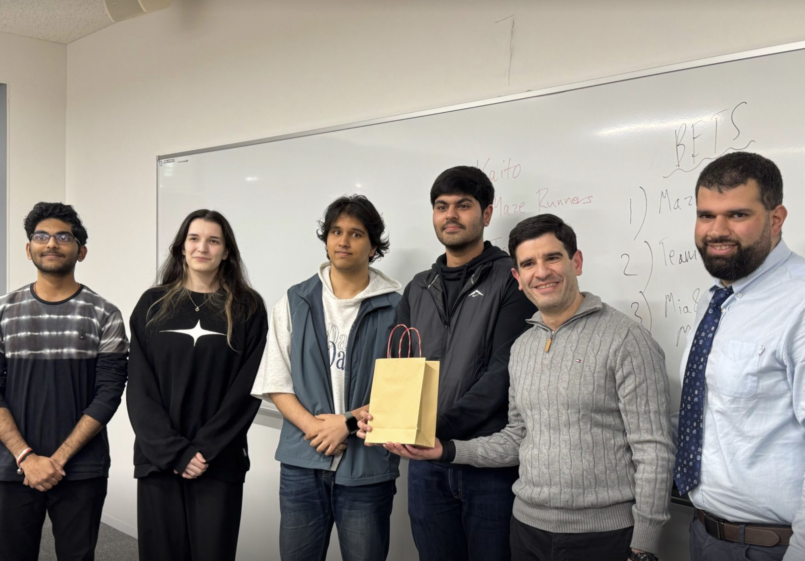
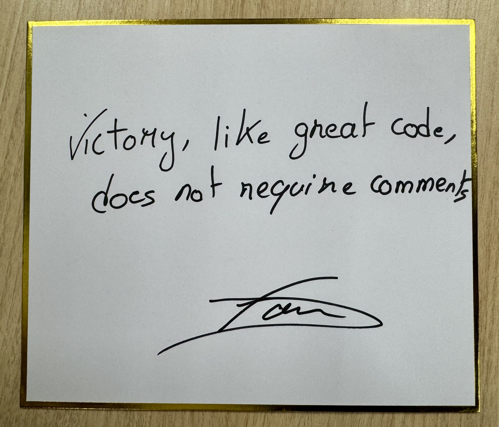

# TUJ Game Jam 2025

## Project Overview

**TUJ Game Jam 2025** is a Python/Pygame boss-battle game created for Temple University Japan's Game Jam. The theme was **"Life is a lie"**.

The game presents itself as a traditional difficult boss fight, but the ending depends on recognizing that combat is not the only path forward. Its victory condition is empathy-based rather than a standard combat victory.

## Achievement

**1st Place Winner - Temple University Japan Game Jam**



*Team Golem receiving recognition for winning 1st place at TUJ Game Jam 2025.*

## Gameplay Concept

Players enter a boss encounter that appears to reward persistence through combat. As the fight progresses, the game introduces misleading expectations and phase changes that support the theme, **"Life is a lie"**.

The intended discovery is that the boss battle can be resolved through an unconventional empathy-based ending. This preserves the structure of a boss fight while asking the player to question the rules they were given.

## Technologies Used

- Python
- Pygame 2.6.1

## Installation

Clone the repository:

```bash
git clone https://github.com/JaideepUppal/TUJ-Game-Jam-2025.git
cd TUJ-Game-Jam-2025
```

Install dependencies:

```bash
python3 -m pip install -r requirements.txt
```

## How to Run

```bash
python3 main-game-file.py
```

## Controls

- `ENTER`: Start the game or return to the menu after winning/losing
- `W`, `A`, `S`, `D`: Move
- `LEFT SHIFT` + direction: Dash
- `K`: Shoot
- `E`: Interact with roses during the later phase
- Close the Pygame window to quit

## Project Structure

```text
TUJ-Game-Jam-2025/
|-- main-game-file.py          # Main Pygame entry point
|-- requirements.txt           # Python dependency list
|-- README.md                  # Project documentation
|-- PokemonGb-RAeo.ttf         # Game font
|-- intro_music.mp3            # Intro music
|-- main_music.mp3             # Main gameplay music
|-- game/
|   |-- boss.py                # Boss behavior and attacks
|   |-- constants.py           # Shared gameplay constants
|   |-- game_state.py          # Game state and phase tracking
|   |-- init-file.py           # Package marker from the original jam project
|   |-- player.py              # Player movement, dash, stun, and rose state
|   `-- projectile.py          # Projectile movement and collision checks
`-- assets/
    `-- images/
        |-- background.webp
        |-- backgroundTemple.webp
        |-- boss.png
        |-- boss_projectile.png
        |-- lava.jpg
        |-- player.png
        |-- projectile.png
        |-- rock.png
        |-- rose.webp
        |-- roseBW.png
        |-- stomp.png
        |-- team-award.jpeg
        |-- victory-note.jpeg
        `-- worm.png
```

## Skills Demonstrated

- Gameplay programming with Python and Pygame
- Real-time input handling
- Player movement, dashing, and collision response
- Boss phase and state management
- Projectile behavior and collision detection
- Asset integration for images, fonts, and music
- Audio fallback handling for demo robustness
- Rapid prototyping under game jam time constraints
- Designing gameplay around a theme-driven emotional twist

## Team

Team Golem:

- Jaideep Uppal
- Sushant Bharadwaj Kagolanu
- Riju Pant
- Bettina Marksteiner

## Recognition



*Victory note from the professor/judges: "Victory, like great code, does not require comments."*

## Screenshots

Additional gameplay screenshots or a short demo video can be added here.

## Future Improvements

- Add gameplay screenshots or a recorded demo clip.
- Add a short credits section for asset and audio sources, if needed.
- Package the game for easier non-developer playtesting.
